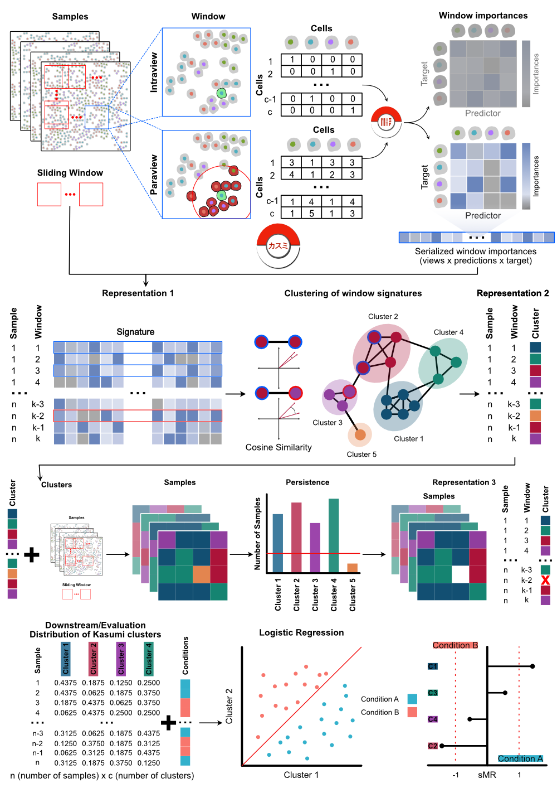

# Kasumi 

<!-- badges: start -->

<!-- badges: end -->

## Overview

Kasumi is a method for the identification of spatially localized neighborhoods of intra- and intercellular relationships, persistent across samples and conditions. Kasumi learns compressed explainable representations of spatial omics samples while preserving relevant biological signals that are readily deployable for data exploration and hypothesis generation, facilitating translational tasks.



## System Requirements

**kasumi** requires a standard configuration and enough RAM to store the analyzed dataset and to support in-memory operations.

The package requires R version 4.1 or higher. This package is developed on macOS Sonoma. The package is compatible with Linux and maxOS operating systems and should be compatible with Windows.

## Installation

You can install the latest version from GitHub with `remotes`:

``` r
# install.packages("remotes")
remotes::install_github("jtanevski/kasumi")
```

**kasumi** currently depends on **mistyR** version 1.99.10 or higher. You can install the latest version from GitHub:

``` r
remotes::install_github("jtanevski/mistyR")
```

## Running Kasumi

Here you can find a vignette for running Kasumi on one of the datasets from the manuscript - [PDF](vignettes/CTCL.pdf), [HTML](vignettes/CTCL.html) or [Rmd](vignettes/CTCL.Rmd)

The Kasumi implementation used to generate the results for the manuscript together with streamlined examples can be found at [saezlab/kasumi_bench](https://github.com/saezlab/kasumi_bench).

## Citation

If you use **kasumi** for your research please cite the [following publication](https://doi.org/10.1038/s41467-025-59448-0):

> Jovan Tanevski, Loan Vulliard, Miguel A. Ibarra-Arellano, Denis Schapiro, Felix J. Hartmann, Julio Saez-Rodriguez. Learning tissue representation by identification of persistent local patterns in spatial omics data. Nat Communications 16, 4071 (2025). <https://doi.org/10.1038/s41467-025-59448-0>
